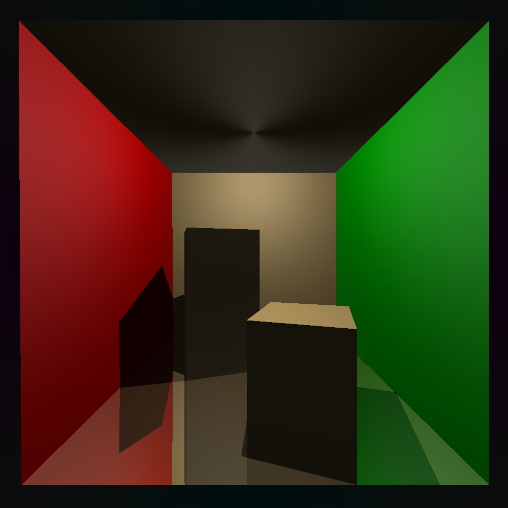

# NBM_Tracer
~~NotBitcoinMiner(NBM)~~ Raytracer

Simple Networked Raytracer that distributes raytracing
over many computers using TCP.



> NOTE: only works for linux for now....

## Client

To run the client download the latest [binary](https://github.com/agmui/NBM_Tracer/releases/download/v1.0.0/NBM_Tracer_Client)

```bash
chmod +x ./NBM_Tracer_Client
./NBM_Tracer_Client <ip> <port>
```

## Server

To run the client download the latest [binary](https://github.com/agmui/NBM_Tracer/releases/download/v1.0.0/NBM_Tracer_Client)

```bash
chmod +x ./NBM_Tracer_Server
```

## Building

run cmake

```bash
git clone ...
mkdir build
cd build
cmake ..
make
```
